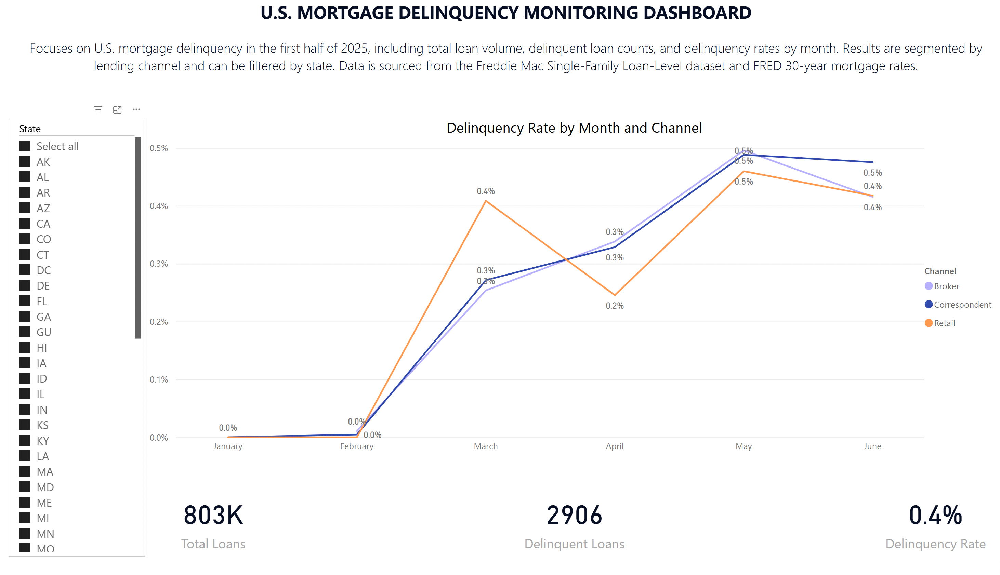
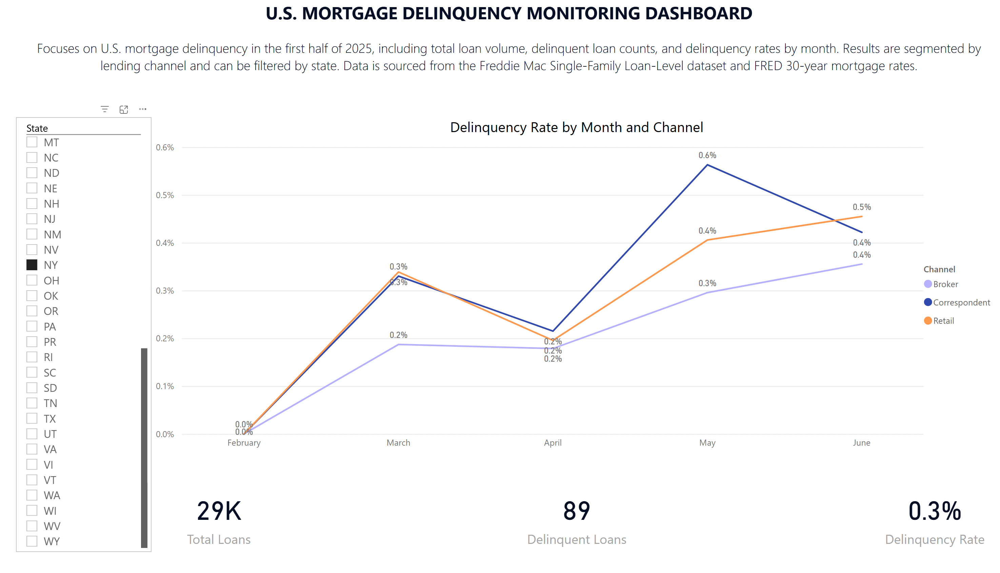
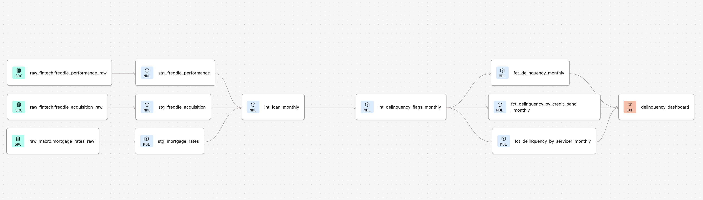
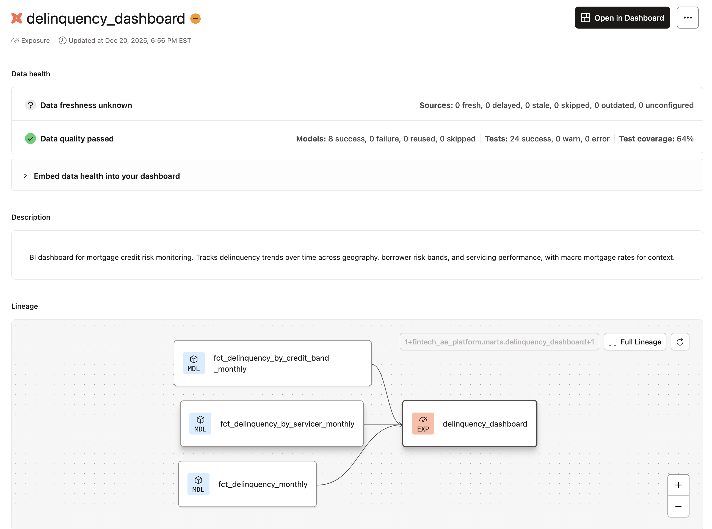
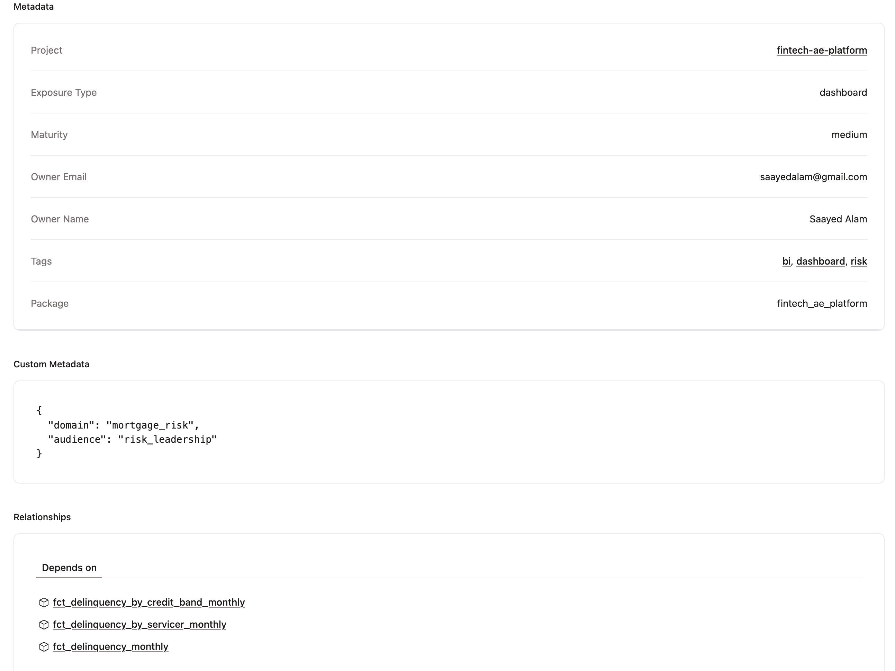

<h1 align="center">🏦 Fintech Analytics Engineering Platform</h1>

<p align="center">
  <strong>dbt Cloud • BigQuery • Power BI • Mortgage Credit Risk</strong>
</p>

---

## 🚀 Overview

This project demonstrates an **end-to-end Analytics Engineering platform** built using **dbt Cloud, BigQuery, and Power BI**, focused on **mortgage credit risk analytics**.

The goal is to show how raw financial and macroeconomic data can be transformed into **reliable, tested, documented, BI-ready datasets and interactive dashboards** using modern analytics engineering best practices.

---

## 🖼 Screenshots

### 📊 Main Power BI Dashboard



---

<details>
  <summary><strong>▶️ More screenshots (click to expand)</strong></summary>

#### 🗺️ Power BI – State Filter Example (NY)



#### 🧭 dbt DAG (Marts Layer)



#### 📚 dbt Model Documentation





</details>

---

## 🎯 Problem Statement

Mortgage delinquency is a core risk metric for financial institutions.  
To analyze and monitor this risk effectively, teams need:

- 📊 Consistent loan-level and monthly performance data  
- 🧮 Clear definitions of delinquency metrics  
- ✅ Confidence in data quality and freshness  
- 🔍 Transparent lineage from raw data to business dashboards  

This project simulates how an analytics engineering team would design and operate such a system.

---

## 🧰 Tech Stack

| Layer | Tool |
|-----|-----|
| Data Warehouse | BigQuery |
| Transformations | dbt Cloud |
| Source Data | Freddie Mac, FRED |
| Orchestration | dbt Cloud Deploy Job |
| Documentation | dbt Cloud Catalog |
| BI / Visualization | Power BI |

---

## 🏗️ Architecture & Data Flow

```
Sources
  ↓
Staging (stg_)
  ↓
Intermediate (int_)
  ↓
Marts (fct_)
  ↓
Exposure (Power BI Dashboard)
```

---

## 🗄️ Data Sources

### Raw Inputs (Loaded Unchanged)

- **Freddie Mac Single-Family Loan-Level Dataset (Acquisition)**  
  https://www.freddiemac.com/research/dataset/single-family-loan-level-dataset

- **Freddie Mac Single-Family Loan-Level Dataset (Monthly Performance)**  
  https://www.freddiemac.com/research/dataset/single-family-loan-level-dataset

- **FRED 30-Year Fixed Mortgage Rate (MORTGAGE30US)**  
  https://fred.stlouisfed.org/series/MORTGAGE30US

Source freshness checks are defined to monitor upstream data availability.

---

## 🧹 Staging Models (stg_)

Purpose: Create clean, predictable inputs.

- One-to-one with source tables  
- Renaming generic columns  
- Explicit type casting  
- Light date parsing  
- No joins or aggregations  

---

## 🧠 Intermediate Models (int_)

Purpose: Reusable business logic.

- `int_loan_monthly` aligns data to the loan-month grain  
- `int_delinquency_flags_monthly` centralizes delinquency logic  

This prevents logic duplication and improves maintainability.

---

## 📊 Mart Models (fct_)

BI-ready fact tables:

- `fct_delinquency_monthly`
- `fct_delinquency_by_credit_band_monthly`
- `fct_delinquency_by_servicer_monthly`

Each mart includes:
- Loan-month counts  
- Delinquency metrics  
- Aggregations by time, geography, channel, credit band, or servicer  

Dimensions are embedded directly to simplify BI usage.

---

## ✅ Data Quality & Testing

High-signal data quality checks include:

- not_null and unique tests  
- Relationships test enforcing referential integrity  
- Singular grain test ensuring loan-month uniqueness  
- Source freshness checks  

All tests run as part of a dbt Cloud deploy job.

---

## ♻️ Reusable Logic

A reusable dbt macro standardizes credit score banding logic and is reused across marts to ensure consistency.

---

## 📚 Documentation

All models, columns, tests, and exposures are documented in YAML and rendered via **dbt Cloud Catalog**.

Documentation includes:
- Full lineage graph  
- Model and column descriptions  
- Test coverage and results  
- Exposure definitions  

Docs are generated via a deploy job.

---

## 📦 Deployment & Environments

- Development environment for IDE work  
- Deployment environment for production-style jobs  

Deploy job runs:
- dbt build  
- tests  
- source freshness checks  
- documentation generation  

---

## 🧠 Design Decisions

| Decision | Reason |
|------|------|
| No incremental models | Static dataset |
| No snapshots | No SCD need + free-tier constraints |
| No dim tables | Dimensions are simple and BI-friendly |
| No scheduler | Demonstrates readiness without simulating live ingestion |

---

## 🧪 Example Use Cases

- Track delinquency trends over time  
- Compare delinquency by credit quality  
- Identify higher-risk servicers  
- Analyze macro rate context alongside loan performance  

---

## 🔌 Exposure

A dbt exposure represents the downstream BI dashboard:
- Explicit ownership  
- Business context  
- Dependencies across marts  

---

## 📊 Power BI Dashboard – U.S. Mortgage Delinquency

This project includes a Power BI dashboard that visualizes:

- total loans  
- delinquent loan counts  
- delinquency rate over time  
- lending channels (Broker, Correspondent, Retail)  
- optional drill-down by U.S. state  

The dashboard is built directly on top of the curated mart:

```
fct_delinquency_monthly
```

**Open the dashboard (.pbix)**

Download from:

```
/power/fintech-ae-powerbi.pbix
```

Data sources visualized:

- Freddie Mac Single-Family Loan-Level dataset  
- FRED 30-Year Fixed Mortgage Rate (MORTGAGE30US)

---

## ⭐ Final Note

This project prioritizes **clarity, correctness, and maintainability**, reflecting real-world analytics engineering judgment.
  